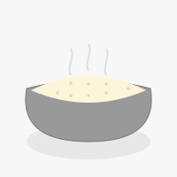
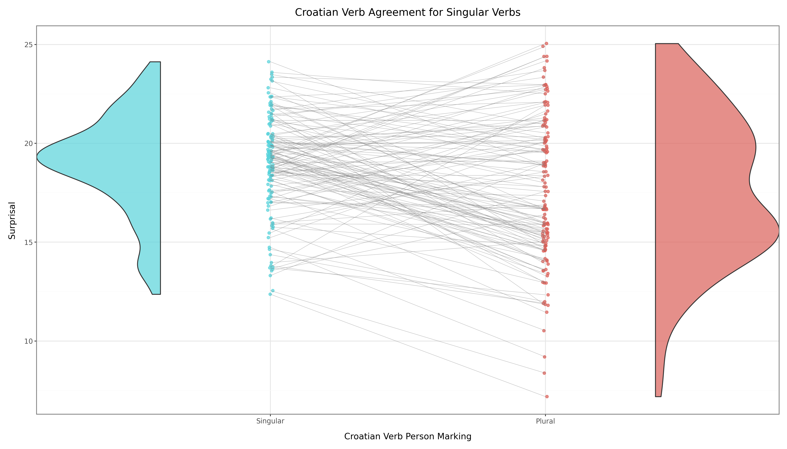

<!-- Improved compatibility of back to top link: See: https://github.com/othneildrew/Best-README-Template/pull/73 -->
<a id="readme-top"></a>
<!--
*** Thanks for checking out the Best-README-Template. If you have a suggestion
*** that would make this better, please fork the repo and create a pull request
*** or simply open an issue with the tag "enhancement".
*** Don't forget to give the project a star!
*** Thanks again! Now go create something AMAZING! :D
-->


<!-- PROJECT SHIELDS -->
<!--
*** I'm using markdown "reference style" links for readability.
*** Reference links are enclosed in brackets [ ] instead of parentheses ( ).
*** See the bottom of this document for the declaration of the reference variables
*** for contributors-url, forks-url, etc. This is an optional, concise syntax you may use.
*** https://www.markdownguide.org/basic-syntax/#reference-style-links
-->


<!-- PROJECT LOGO -->
<br />
<div align="center">
    

  <h3 align="center">Grew-TSE</h3>
  
  <p align="center">
  [ˈɡʁʏ.tsə]
  </p>

  <p align="center">
    Python Package for Targeted Syntactic Evaluation of LLMs Cross-Linguistically
    <br />
    <!-- <a href="https://github.com/othneildrew/Best-README-Template"><strong>Explore the docs »</strong></a> -->
    <br />
    <br />
    <a href="">View Demo</a>
    &middot;
    <a href="https://github.com/DanielGall500/Grew-TSE/issues/new?labels=bug&template=bug-report---.md">Report Bug</a>
    &middot;
    <a href="https://github.com/DanielGall500/Grew-TSE/issues/new?labels=enhancement&template=feature-request---.md">Request Feature</a>
  </p>
</div>

<!-- ABOUT THE PROJECT -->
## About The Project
Grew-TSE is a tool for query-based generation of Minimal Pair datasets from treebanks for Targeted Syntactic Evaluation of LLMs. The query language of choice is [GREW (Graph Rewriting for NLP)](https://grew.fr/). Pronounced like the german word Grütze, meaning grits or groats.

#### Try It Live on Hugging Face

You can try out the `GrewTSE` package interactively on Hugging Face Spaces:

[Launch GrewTSE Space](https://huggingface.co/spaces/DanielGallagherIRE/GrewTSE)

## How Does It Work?
The first step in using this package is to create a _lexical item set_, which is a fancy way of saying a dataset of words and their features. These are used to identify the _ungrammatical_ word for every _grammatical_ word that you isolate in your Grew query.
```python
grewtse = Grewtse()

# parse the treebank
treebank_path = "./my-treebanks/german.conllu"
grewtse.parse_treebank(treebank_path)
```

The deeper your knowledge of a language, the better you'll be at choosing syntactic phenomena to evaluate. Treebanks that are more expressive in terms of features will allow you to ask more questions and those that are of a larger size will be more likely to find suitable minimal pairs. The minimal pairs are found by isolating that word and its features, and altering the features by (typically) one. For instance, by changing an accusative noun to a genitive one. Note that morphological constraints (e.g Case, Gender, Number) are passed distinctly from universal constraints (upos) These are specified in a dict, like so:
```python
ungrammatical_morphology_change = {
  "case": "Gen"
}
```

A _Grew query_ and a _dependency node_ form the means by which we isolate individual phenomena and the target word, typically the grammatical word, for our grammatical-ungrammatical minimal pair. The Grew query feature values may change between treebanks, but the logic of the query should remain consistent. The _dependency node_ is that variable in our grew query that represents that target word. For instance, ```V``` in the below query is isolated represeneting the verb. The dependency node must be a variable specified in the grew query. The below fancy-schmancy query isolates non-negated transitive verb phrases:
```python
grew_query = """
  pattern {
    V [upos=VERB];
    DirObj [Case=Gen];
    V -[obj]-> DirObj;
  }

  without {
    NEG [upos=PART, Polarity=Neg];
    V -[advmod:neg]-> NEG;
  }
"""

dependency_node = "V"
```

The generation of grammatical-ungrammatical minimal pairs for each sentence, as well as the automatic masking of that sentence, can then be undertaken with the following:
```python
# generate a dataset from the treebank that creates masked
# sentences for masked language modeling (MLM)
masked_df = grewtse.generate_masked_dataset(
    grew_query, 
    dependency_node
)

# generate a dataset from the treebank that creates prompts
# for next-word prediction
prompt_df = grewtse.generate_prompt_dataset(
    grew_query, 
    dependency_node
)

# can only occur after a masked or prompt dataset
# has been generated
mp_dataset = grewtse.generate_minimal_pairs(
    alternative_morph_features,
    alternative_upos_features
)
```

### Prerequisites
In order to use this package, you will need to install the necessary requirements to use ```Grewpy``` through the [official install page](https://grew.fr/usage/python/). This requires the installation of ```opam```, ```ocaml```, and ```grew```. Grewpy has been tested for Linux and Mac, and for Windows it should work fine through WSL. Once you've done this, you can install ```grewtse``` by running the following command:
Make sure you've installed the package and its dependencies:
```bash
pip install grewtse
```
Also, ensure you have access to the desired CoNLL-U file (e.g., from [Universal Dependencies](https://universaldependencies.org/)).

### Built With
Grew-TSE was built completely in Python and is available soon as a Python package. It makes use of the ```Huggingface Transformers``` library as well as ```plotnine``` for plotting.
* [![Python][Python]][Python-url]
* [![Huggingface][Huggingface]][Huggingface-url]

---

## Example: Evaluating BERT on Croatian Verb Agreement
Let's try out an example. We'll test how well a BERT model performs in predicting the correct singular verb form versus the incorrect plural verb form. The steps involve:
1. Parsing a Universal Dependencies treebank in CoNLL-U format
2. Masking morphological features using a [GREW query](http://grew.fr/)
3. Generating minimal pairs for this feature
4. Evaluating a BERT-style model using masked language modeling
5. Visualising the model’s syntactic sensitivity

---

### Evaluating Croatian Verb Agreement
Begin by importing the Grewtse class.
```python
from grewtse.pipeline import Grewtse
```

Make sure you have your treebank stored as a ```.conllu``` file somewhere locally. For instance, in a ```treebanks``` folder.
```python
treebank_path = "treebanks/UD_Croatian-SET@2.16.conllu"
```

The GREW query we'll use will isolate the verbs in sentences from the treebank using the following GREW query. Note that we leave out the ```pattern {}``` syntax that we may use in GREW queries and just include the core query.
```python
# a query to identify all verbs that are singular
grew_query = """
  V [upos=VERB, Number=Sing];
"""

# the dependency node is the specific labelled object that we want to isolate from our query. In this case, the object V for verb.
dependency_node = "V"
```

In order to generate minimal pairs, we will need to specify which features we want to change from the original isolated form. In this case, we'll change the ```number``` feature to ```Plur``` for plural. Note that there is a distinction between universal features e.g upos and morphological features.
```python
# morphological feature Singular → Plural
alternative_morph_features = {
    "number": "Plur"
}
# we're not changing UPOS tags in this example
alternative_upos_features = {}
```

Lastly, we want to choose a particular BERT model from Hugging Face.
Thanks to the following work for the BERT model:
> [Ljubešić & Lauc (2021)](https://www.aclweb.org/anthology/2021.bsnlp-1.5)  
**BERTić – The Transformer Language Model for Bosnian, Croatian, Montenegrin and Serbian**  
*Nikola Ljubešić and Davor Lauc*.  
In *Proceedings of the 8th Workshop on Balto-Slavic Natural Language Processing*, Kyiv, Ukraine, 2021. Association for Computational Linguistics, pp. 37–42.
```python
# choose a BERT model for MLM from Hugging Face
model_repo = "classla/bcms-bertic"
```

Now let's get down to using the actual package itself for dataset creation, evaluation and performance visualisation.
```python
grewtse = Grewtse()

# parse the treebank
grewtse.parse_treebank(treebank_path)

# generate a masked dataset using the GREW query
masked_df = grewtse.generate_masked_dataset(grew_query, dependency_node)
print(f"Generated masked dataset of size {masked_df.shape[0]}")

# create minimal pairs (i.e. Singular / Plural verb forms)
mp_dataset = grewtse.generate_minimal_pairs(
    alternative_morph_features,
    alternative_upos_features
)
mp_dataset.to_csv("minimal-pair-datasets/UD_Croatian-SET@2.16_dataset.csv")
print(f"Dataset of {mp_dataset.shape[0]} minimal pairs created for Croatian.")

# evaluate a BERT MLM model on the minimal pair dataset
results_df = grewtse.evaluate_bert_mlm(model_repo)
results_df.to_csv("minimal-pair-evaluations/UD_Croatian-SET@2.16_evaluation.csv")

# visualise model performance as a PNG
grewtse.visualise_syntactic_performance(
    output_path="minimal-pair-evaluations/UD_Croatian-SET@2.16_visualisation.png",
    results_df=results_df,
    original_label="Singular",
    alternative_label="Plural",
    title="Croatian Verb Person Marking",
    ylabel="Surprisal",
    legend_title="Croatian Verb Agreement for Singular Verbs"
)
```
This creates a hefty dataset of ~3000 minimal pairs for this syntactic feature in Croatian, each accompanied by a masked sentence.
Additionally, it evaluates the ```BERTić``` model on each minimal pair and provides a final visualisation with the results.



<!-- MARKDOWN LINKS & IMAGES -->
<!-- https://www.markdownguide.org/basic-syntax/#reference-style-links -->
[issues-shield]: https://img.shields.io/github/issues/othneildrew/Best-README-Template.svg?style=for-the-badge
[issues-url]: https://github.com/othneildrew/Best-README-Template/issues
[license-shield]: https://img.shields.io/github/license/othneildrew/Best-README-Template.svg?style=for-the-badge
[license-url]: https://github.com/othneildrew/Best-README-Template/blob/master/LICENSE.txt
[linkedin-shield]: https://img.shields.io/badge/-LinkedIn-black.svg?style=for-the-badge&logo=linkedin&colorB=555
[linkedin-url]: https://www.linkedin.com/in/daniel-gallagher-a520161a3/
[product-screenshot]: images/screenshot.png

[Python]: https://img.shields.io/badge/python-3670A0?style=for-the-badge&logo=python&logoColor=ffdd54
[Python-url]: https://www.python.org/

[Huggingface]: https://img.shields.io/badge/-HuggingFace-3B4252?style=flat&logo=huggingface&logoColor=
[Huggingface-url]: https://huggingface.co/

---

For questions or academic collaboration inquiries, please contact the maintainer via the GitHub repository.
